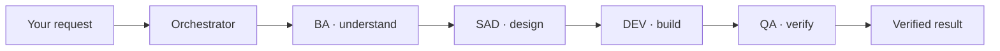
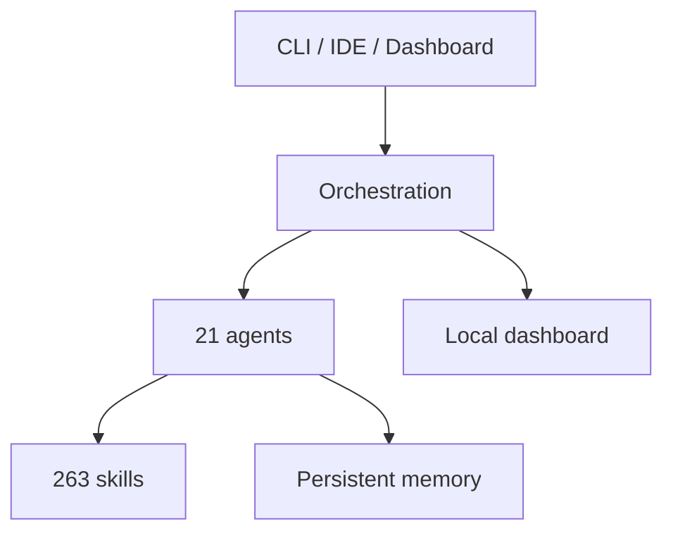

# Gentle-Vanguard

<p align="center">
  
</p>

<p align="center">
  
  
  
  
</p>

> **Your AI writes code. Gentle-Vanguard makes sure it's done right.** An orchestration layer that
> adds structure, memory and verification to the AI coding tools you already use.

---

## The Problem You Know Too Well

AI-assisted coding is fast — until it isn't:

| Without Gentle-Vanguard                       | With Gentle-Vanguard                                              |
| --------------------------------------------- | ----------------------------------------------------------------- |
| 🔁 Every session starts from zero             | 🧠 Decisions and context persist across sessions                  |
| 🎲 Quality depends on luck                    | ✅ Every change is verified before it's called done               |
| 🌊 One giant prompt tries to do everything    | 🎯 Work routes to specialized agents (design, code, QA, security) |
| 💸 Costs are invisible until the bill arrives | 📊 A local dashboard shows tokens, traces and health in real time |
| 🔓 Secrets and risky changes slip through     | 🛡️ Quality gates, secret scanning and audit trails by default     |

## How It Works

One flow, deliberately simple: **understand → design → build → verify**.



It works **alongside** OpenCode, Claude Code, Cline, Cursor, Windsurf and Codex — locally, with no
mandatory cloud service.

## Get Started

### Option A — One-click launcher (Windows)

Download `Gentle-Vanguard-Setup-4.0.0.exe` from the
[releases page](https://github.com/EmmanuelOrtiz87/gentle-vanguard-public/releases/latest) and run
it. No Node.js, no dependencies — a single self-contained binary that guides you through setup.

### Option B — From source (all platforms)

```bash
git clone https://github.com/EmmanuelOrtiz87/gentle-vanguard-public.git
cd gentle-vanguard-public
pnpm install
npx tsx src/setup-complete.ts
npm run start
```

Requirements: Node.js 20+, pnpm 11+ and Git. Windows, macOS and Linux are supported.

## What's Inside

A curated look at the core capabilities — the [full documentation](#explore-further) covers
everything.

- **🤖 21 specialized agents** — requirements, architecture, implementation, QA, operations,
  security and docs, each with its own focus.
- **📚 263 on-demand skills** — loaded only when a task needs them, from development to compliance.
- **🧠 Engram memory** — decisions, bugs and conventions survive across sessions and compactions.
- **📊 Local dashboard** — real-time metrics, tracing waterfall, alerts and feedback. No mock data.
- **🛡️ Security built-in** — secret scanning, SBOM, provenance and quality gates in the delivery
  pipeline.
- **♻️ Self-healing processes** — a native process reaper recycles stale daemons, kills duplicates
  and hung tasks at every session start, close and health check.
- **🎓 Built-in Academy** — 9 tracks / 85 lessons in Spanish (tri-lingual UI) covering the stack,
  agents, workflows, prompt engineering and methodology (SDD · TDD · BDD · RDD).



## Explore Further

| Resource                                             | Description                    |
| ---------------------------------------------------- | ------------------------------ |
| [Getting Started](docs/getting-started/README.md)    | First-time setup, step by step |
| [Architecture](docs/architecture/README.md)          | Full technical reference       |
| [Installation](docs/getting-started/installation.md) | All installation options       |
| [Examples](docs/use-cases/EXAMPLES.md)               | Usage examples                 |
| [Changelog](CHANGELOG.md)                            | Version history                |

## License

MIT © 2026 Emmanuel Ortiz
