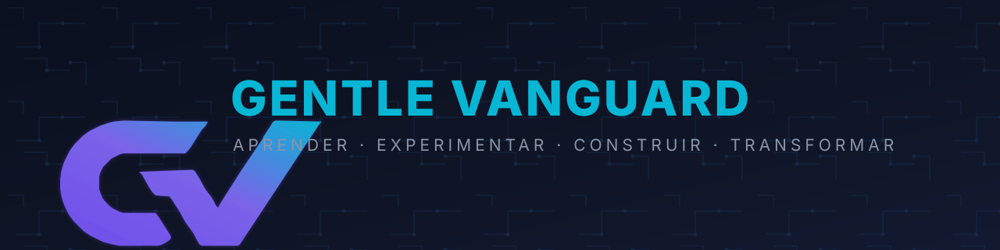
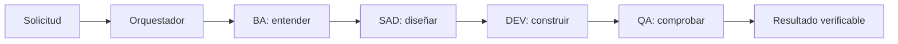
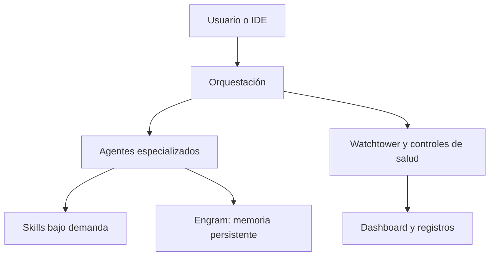
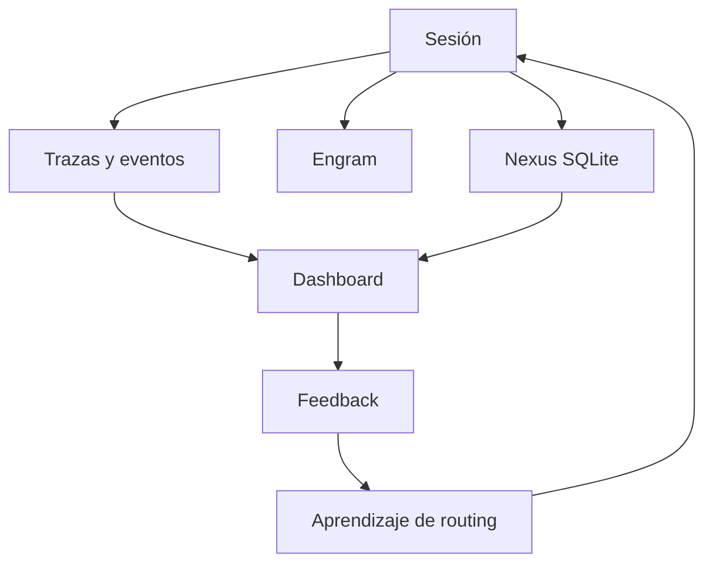

# Gentle-Vanguard

<p align="center">
  
</p>

<p align="center">
  
  
  
  
</p>

<p align="center"><strong>Una capa de orquestación para trabajar mejor con asistentes de IA.</strong><br>
21 agents · 263 skills · ordena el trabajo, conserva el contexto y verifica los resultados.</p>

## What is Gentle-Vanguard?

Gentle-Vanguard convierte una herramienta de programación con IA en un flujo de trabajo más
predecible. **Routes work** al especialista adecuado, **Enforces SDD** entre exploración y
verificación, y **Persists memory** entre sesiones antes de considerar terminado un cambio.

No es un modelo de IA ni reemplaza tu editor. Es una capa local que puede trabajar con OpenCode,
Claude Code, Cline, Cursor, Windsurf, Codex y otras herramientas compatibles.

### ¿Qué problemas resuelve?

- Evita que cada tarea empiece sin contexto.
- Separa análisis, diseño, implementación y verificación.
- Reduce respuestas genéricas mediante agentes especializados.
- Hace visibles los costos, errores y resultados de cada sesión.
- Mantiene la memoria, los checkpoints y los registros en tu equipo.

## Inicio rápido

Requisitos: Node.js 20+, pnpm 11+ y Git. Windows, macOS y Linux son compatibles.

```bash
git clone https://github.com/EmmanuelOrtiz87/gentle-vanguard.git
cd gentle-vanguard
pnpm install
npx tsx src/setup-complete.ts
npm run start
```

Para iniciar una sesión del stack:

```bash
npx tsx src/session/session-autostart.ts
```

Para verificar la instalación:

```bash
gv check
npm run watchtower:health
```

## Cómo funciona

El flujo normal es deliberadamente simple: entender, diseñar, construir y comprobar.



### Arquitectura resumida

Esta es una **5-Layer Architecture** simplificada. El **Work Routing Ladder** y las **Delegation
Rules** determinan qué agente recibe cada solicitud.



La arquitectura completa, los contratos y los diagramas ampliados están en
[`docs/technical/STACK-DOCUMENTATION.md`](docs/technical/STACK-DOCUMENTATION.md).

### Superficies canónicas del stack

La arquitectura modular por dominios es parte nativa del stack actual; no es una edición, producto
ni fase independiente. Las superficies tienen responsabilidades separadas:

- **Academy:** `apps/academy-web` — aprendizaje y documentación educativa.
- **Documentación formal:** `docs/presentations` — presentaciones y material formal publicado.
- **Analytics:** `apps/gv-analytics` — aplicación nativa de análisis.
- **CMS local-first:** `apps/content-cms` — superficie local-first para gestión de contenido.
- **Dashboard:** `apps/web-dashboard` — observabilidad y operación en tiempo real.

## Agentes y capacidades

El stack incluye **21 agentes** y **263 skills**. Los roles principales son:

| Rol          | Propósito                                  |
| ------------ | ------------------------------------------ |
| Orchestrator | Coordina la sesión y deriva cada solicitud |
| BA           | Explora requisitos y detecta ambigüedades  |
| SAD          | Diseña arquitectura y contratos            |
| DEV          | Implementa y refactoriza                   |
| QA           | Ejecuta pruebas y validaciones             |
| OPS          | Automatiza infraestructura y CI/CD         |
| GOV          | Revisa seguridad, cumplimiento y políticas |
| DOC          | Mantiene documentación y decisiones        |

El **Model Profile** adapta el comportamiento por fase. La **Skill Registry** carga solo las
capacidades necesarias. El **Chain-Delivery** conserva el contrato entre BA, SAD, DEV y QA.

## Key Capabilities

- **SDD Lifecycle**: Explore → Design → Implement → Verify.
- **SDD Research Lane**: evidencia externa versionada ligada al caso (`.sdd/<feature>/RESEARCH/`).
- **RDD (Receipt-Driven Development)**: revisión por riesgo con 4R, recibos ligados a Git SHA, 5
  gates de entrega y kill-switch de emergencia (expira 24h).
- **Review Workload Guard**: distribuye revisiones pendientes entre agentes.
- **Skill Registry**: carga capacidades bajo demanda.
- **Chain-Delivery**: conserva contratos entre fases.
- **Cross-Tool**: permite operar con varias herramientas de desarrollo con IA.
- **Process Hygiene**: reaper nativo de procesos (duplicados, one-shots colgados, daemons
  envejecidos, pidfiles stale) integrado en autostart/watchtower/session-close.
- **Unified Guardrail Orchestrator**: un punto central donde el orquestador consulta "¿qué hacer
  ante este fallo?" y obtiene una decisión coherente + aprendizaje. Clasifica fallos en 10
  categorías (config, network, model, db, git, security, resource, reasoning, quality, unknown),
  decide la acción (retry, correct, escalate, isolate, continue, block), ejecuta delegando a los
  guardrails especializados y aprende del resultado. Complementa al **anti-loop guard** (detecta
  bucles de razonamiento) y a la **watchtower** (salud/auto-healing).

## Memoria, observabilidad y seguridad

- **Engram** conserva decisiones y aprendizajes entre sesiones.
- **Nexus** almacena métricas, eventos, trazas, alertas y resultados.
- **Dashboard** muestra actividad, costos, salud, trazas y feedback en tiempo real.
- **Watchtower** ejecuta controles de salud y recuperación automática.
- **Guardrail Orchestrator** clasifica fallos, decide la acción correctiva y aprende del resultado
  (resiliencia autónoma sin intervención humana).
- **Anti-loop guard** detecta bucles de razonamiento y fuerza cambio de estrategia o escalación.
- **Secret scanner**, SBOM, SLSA y hooks ayudan a proteger el ciclo de entrega.



## Comandos frecuentes

| Comando                                                  | Uso                                |
| -------------------------------------------------------- | ---------------------------------- |
| `npm run start`                                          | Iniciar el dashboard               |
| `npx tsx src/session/session-autostart.ts`               | Inicializar una sesión completa    |
| `npm run watchtower:health`                              | Revisar salud del stack            |
| `npm run process:hygiene`                                | Detectar procesos basura (dry-run) |
| `npm run process:reap`                                   | Limpiar procesos basura            |
| `npm run sdd:research -- run -f <feature> -q "q1;q2"`    | Research lane SDD                  |
| `npm run typecheck`                                      | Comprobar TypeScript               |
| `npm run lint`                                           | Ejecutar lint                      |
| `npm test`                                               | Ejecutar las pruebas               |
| `npm run db:health`                                      | Revisar Nexus                      |
| `npm run graphify -- query "..."`                        | Consultar el grafo del código      |
| `npx tsx src/guardrail-orchestrator.ts decide "<error>"` | Decidir acción ante un fallo       |
| `npx tsx src/guardrail-orchestrator.ts stats`            | Ver estadísticas de aprendizaje    |

## Documentación

| Documento                                                        | Para quién                            |
| ---------------------------------------------------------------- | ------------------------------------- |
| [Documentación técnica](docs/technical/STACK-DOCUMENTATION.md)   | Arquitectura, componentes y operación |
| [Guía de inicio](docs/getting-started/README.md)                 | Instalación paso a paso               |
| [Comandos rápidos](docs/operations/procedures/QUICK-COMMANDS.md) | Referencia operativa                  |
| [Arquitectura](docs/architecture/README.md)                      | Decisiones y límites del sistema      |
| [Seguridad](docs/security/README.md)                             | Controles y prácticas de seguridad    |
| [ADRs](docs/adr/README.md)                                       | Decisiones arquitectónicas            |
| [Lifecycle de scripts](docs/guides/SCRIPT-LIFECYCLE.md)          | TS-only, CMD-first y legado           |
| [Changelog](CHANGELOG.md)                                        | Historial de cambios                  |

## Development

Antes de proponer un cambio, ejecutá:

```bash
npm run typecheck
npm run lint
npm test
npm run build
```

El proyecto usa SDD: requisitos, diseño, implementación y verificación. Las contribuciones deben
mantener las pruebas, la documentación y los controles de seguridad correspondientes. Los tests se
ejecutan con `node:test` mediante `tsx`; el runtime activo no requiere PowerShell.

## CI/CD Pipeline

Los workflows principales son `gentle-vanguard-quality-gate`, `test-suite`, `security.yml` y
`sync-public`. El repositorio público se actualiza mediante una lista controlada de archivos; no es
un espejo indiscriminado del repositorio interno.

## Release & Distribution

El proceso de release es dual-repo con binario nativo:

| Paso                    | Mecanismo                                                                                       |
| ----------------------- | ----------------------------------------------------------------------------------------------- |
| 1. Versionado           | Bump en `package.json` + commit `chore(release)`                                                |
| 2. Tag anotado          | `git tag -a vX.Y.Z && git push origin vX.Y.Z` — dispara `release.yml`                           |
| 3. Build binario        | Job SEA (windows-latest): bundle → blob → inyección postject → `.exe` autocontenido             |
| 4. Release privado      | GitHub Release + manifest de auto-update                                                        |
| 5. Distribución pública | Asset `.exe` replicado al release de `gentle-vanguard-public`; docs vía `src/sync-to-public.ts` |

Notas operativas: para re-disparar un release fallido, mover el tag (delete + recreate) sobre el
commit corregido. El README público se alimenta exclusivamente de `README-PUBLIC.md` (showcase
curado); el README interno nunca se publica.

## Project Status

| Área          | Estado                                         |
| ------------- | ---------------------------------------------- |
| Configuration | JSON validado por schema y lint                |
| Skills        | 263 skills disponibles                         |
| Tests         | Verificados por CI antes de publicar           |
| Hooks         | Pre-commit, post-commit, post-merge y pre-push |
| Structure     | TypeScript, dashboard, MCP y automatizaciones  |

## Repository Strategy

`gentle-vanguard` es el repositorio de desarrollo y operación. `gentle-vanguard-public` es la
distribución pública curada. La política completa está documentada en
[`docs/REPOSITORY-PUBLICATION.md`](docs/REPOSITORY-PUBLICATION.md).

## Key Documentation

- **AGENTS.md**: reglas de bootstrap y orquestación.
- **Delegation Rules**: `config/auto-delegation.json`.
- **Model Routing**: `config/model-router.json`.
- **SDD Config**: `config/sdd-contracts.json`.
- **Skill Registry**: `skills/` y `config/subagent-mapping.json`.

## License

MIT © 2026 Emmanuel Ortiz
